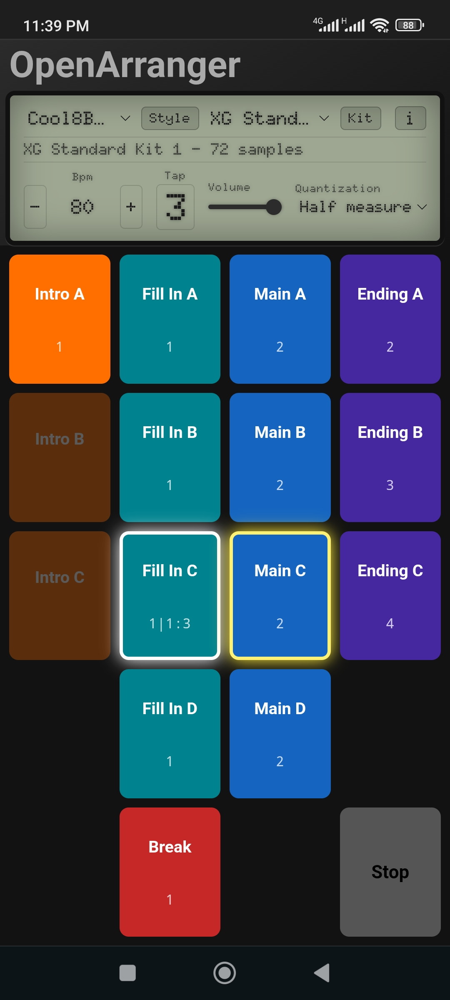

# OpenArranger

O OpenArranger é uma ferramenta de acompanhamento de código aberto, baseada na web e com funcionamento *offline-first* (prioridade offline), projetada para músicos solo que tocam ao vivo. Ele emula o comportamento dos tradicionais teclados arranjadores físicos, permitindo o controle em tempo real de padrões de bateria não-lineares (Mains, Fills, Intros, Endings e Breaks) com zero latência de áudio.



## Principais Recursos

- **Interface focada em performance:** grade vertical ampla e ergonômica, projetada para dispositivos móveis e ambientes de palco.
- **Quantização dinâmica:** transições suaves com execução em compasso inteiro, meio compasso ou um quarto de compasso.
- **Motor de ritmo duplo:** canais independentes para Ritmo Principal e Sub Ritmo, cada um com seleção de kit e controle de volume.
- **Motor de áudio com zero latência:** sincronismo preciso utilizando Web Audio API.
- **Feedback visual:** botões de Intro, Fill e Break mostram antecipadamente a seção de destino.
- **Padrões abertos:** utiliza arquivos MIDI padrão e formatos de texto legíveis.
- **Arquitetura desacoplada:** kits de áudio e estilos são independentes e podem ser combinados livremente.

---

# Kit de Som (.kit)

Um Kit de Som é um arquivo `.zip` renomeado para `.kit`.

Sua estrutura deve conter um ou mais arquivos `.sfz` na raiz e uma única pasta `Samples/` contendo todos os arquivos WAV utilizados.

```
Sounds.kit
├── DrumKit.sfz
├── PercussionKit.sfz
└── Samples/
    ├── 36 Kick.wav
    ├── 37 Side Stick.wav
    └── ...
```

Quando um kit possui vários arquivos SFZ, o OpenArranger disponibiliza um seletor independente para cada canal:

- **Rhythm** (bateria principal)
- **Sub Rhythm** (percussão)

Isso permite combinar diferentes kits durante a execução.

## Opcodes SFZ suportados

### `<control>`

- `default_path`

### `<global>`

- `loop_mode`

### `<group>`

- `group`
- `off_by`

### `<region>`

- `key`
- `sample`

## Exemplo

```sfz
<control> default_path=Samples/

<global> loop_mode=one_shot

<region> key=36 sample=36 Kick.wav
<region> key=37 sample=37 Side Stick.wav
<region> key=38 sample=38 Snare.wav
<region> key=39 sample=39 Hand Clap.wav
<region> key=40 sample=40 Snare Tight.wav
<region> key=41 sample=41 Floor Tom L.wav
<region> key=42 sample=42 Hi-Hat Closed.wav group=1 off_by=1
<region> key=43 sample=43 Floor Tom H.wav
<region> key=44 sample=44 Hi-Hat Pedal.wav group=1 off_by=1
<region> key=45 sample=45 Low Tom.wav
<region> key=46 sample=46 Hi-Hat Open.wav group=1 off_by=1
```

---

# Estilo (.style)

Um Estilo é um arquivo `.zip` renomeado para `.style`.

Ele deve conter exatamente:

- um arquivo `.mid`;
- um arquivo `.json`;

ambos na raiz do arquivo.

```
MyStyle.style
├── style.mid
└── style.json
```

Os nomes dos arquivos não importam; o OpenArranger identifica cada arquivo apenas pela extensão.

É possível carregar vários estilos simultaneamente e alternar entre eles através da interface.

Sempre que um novo estilo é selecionado, sua execução começa na **Intro A**.

---

## Arquivo MIDI

O arquivo MIDI deve ser do **Tipo 0**.

Pode conter um ou mais canais. Normalmente utiliza-se:

- Canal 10 para bateria;
- Canal 9 para percussão.

Entretanto, qualquer canal pode ser utilizado desde que seja informado corretamente no `style.json`.

### Informações ignoradas

O OpenArranger **não utiliza** informações presentes no arquivo MIDI como:

- BPM;
- Time Signature;
- Markers;
- Program Change;
- Control Change.

Essas informações devem ser definidas no arquivo `style.json`.

---

## style.json

| Campo | Tipo | Obrigatório | Descrição |
|-------|------|-------------|-----------|
| `name` | string | ✓ | Nome do estilo |
| `timeSignature` | array | ✓ | Ex.: `[4,4]`, `[6,8]` |
| `bpm` | number | ✓ | Andamento inicial |
| `rhythmChannel` | number | ✓ | Canal MIDI da bateria |
| `subRhythmChannel` | number | ✓ | Canal MIDI da percussão |
| `sections` | object | ✓ | Mapeamento das seções |
| `beatUnit` | string ou number | | Unidade da pulsação em compassos compostos |

### Exemplo

```json
{
  "name": "16BeatBallad",
  "timeSignature": [4, 4],
  "bpm": 60,
  "rhythmChannel": 10,
  "subRhythmChannel": 9,
  "sections": {
    "Main A": { "startBar": 2, "endBar": 6 },
    "Main B": { "startBar": 6, "endBar": 10 },
    "Main C": { "startBar": 10, "endBar": 14 },
    "Main D": { "startBar": 14, "endBar": 18 },
    "Fill In A": { "startBar": 18, "endBar": 19 },
    "Fill In B": { "startBar": 19, "endBar": 20 },
    "Fill In C": { "startBar": 20, "endBar": 21 },
    "Fill In D": { "startBar": 21, "endBar": 22 },
    "Intro A": { "startBar": 22, "endBar": 23 },
    "Intro B": { "startBar": 23, "endBar": 25 },
    "Intro C": { "startBar": 25, "endBar": 29 },
    "Ending A": { "startBar": 29, "endBar": 31 },
    "Ending B": { "startBar": 31, "endBar": 33 },
    "Ending C": { "startBar": 33, "endBar": 36 },
    "Break": { "startBar": 36, "endBar": 37 }
  }
}
```

---

## beatUnit

Em compassos compostos (`6/8`, `9/8`, `12/8` etc.), o campo `beatUnit` define qual é a unidade da pulsação.

| Valor  | Significado       |
|--------|-------------------|
| `4`    | Semínima (padrão) |
| `8`    | Colcheia          |
| `"4."` | Semínima pontuada |
| `2`    | Mínima            |

Exemplo:

```json
{
  "name": "Ballad",
  "timeSignature": [6, 8],
  "beatUnit": "4.",
  "bpm": 72
}
```

Quando omitido, o OpenArranger assume `4`.

---

# Boas práticas para criação de estilos

- Utilize **Markers** na DAW para facilitar futuras edições, mesmo que o OpenArranger os ignore.
- Recomenda-se que **Fills** e **Breaks** tenham apenas um compasso.
- **Intros** e **Endings** podem ter qualquer duração.
- As seções **Main** funcionam melhor com dois ou mais compassos, embora um compasso também seja permitido.
- Para um resultado mais natural, coloque o prato de ataque no último instante do compasso anterior, com duração mínima, criando a sensação de que ele ocorre no início do compasso seguinte.

---

# Licença e Créditos

Este projeto é distribuído sob a Licença MIT.

Veja o arquivo [**LICENCE**](LICENCE).

## Créditos

- Utilitário de ícones maskable por NotWoods
- JSZip